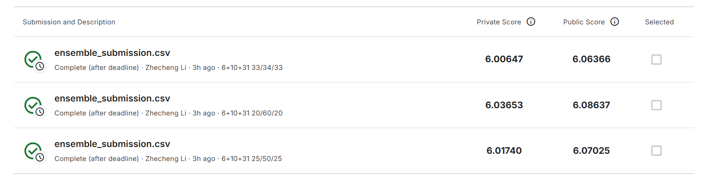
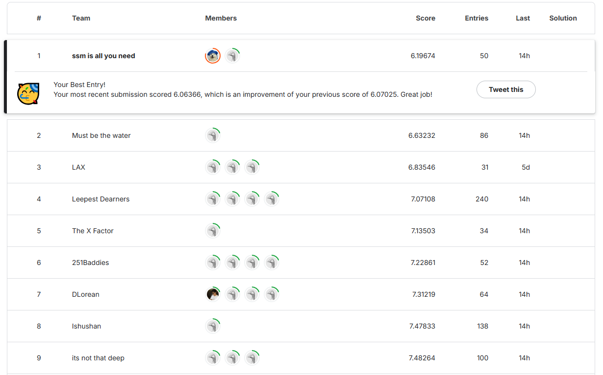
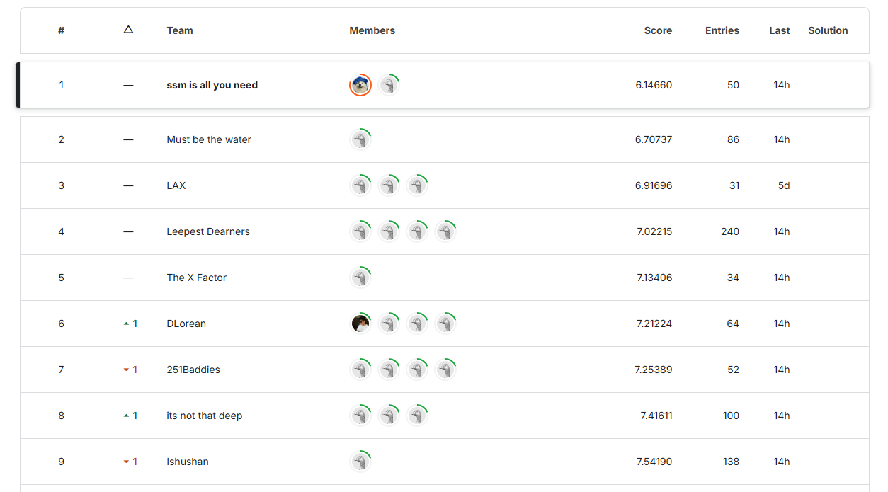

## This GitHub Repo is the 1st Solution for [UCSD-CSE251B-Kaggle-Trajectory-Prediction](https://www.kaggle.com/competitions/cse-251-b-2025) (Spring 2025)

#### Author: [Zhecheng Li](https://github.com/Lizhecheng02) && Professor: [Rose Yu](https://roseyu.com/)

------------------------------------------------------------------------------------------------------------------------

### Python Environment

#### 1. Install Packages

```bash
pip install -r requirements.txt
```

### Prepare Data

#### 1. Set Kaggle Api

```bash
export KAGGLE_USERNAME="your_kaggle_username"
export KAGGLE_KEY="your_api_key"
```

#### 2. Install unzip

```bash
sudo apt install unzip
```

#### 3. Download Datasets
```bash
cd data
kaggle competitions download -c cse-251-b-2025
unzip cse-251-b-2025.zip
```

------------------------------------------------------------------

### Step-by-Step Guidance to Achieve 6.00 on the Kaggle Leaderboard!

The main code you need to run is:

```bash
cd src
chmod +x ./run_all.sh
./run_all.sh
```

To run the InteractionTransformer with different input feature dimensions, you need to modify certain parameters in `run_all.sh`.

For the InteractionTransformer with the original 6 features, we use the following settings:

```bash
#!/bin/bash

for fold in {0..9}
do
    if [ $fold -lt 8 ]; then
        gpu=$fold
    else
        gpu=$((fold - 8))
    fi

    echo "Starting fold $fold on GPU $gpu"
    CUDA_VISIBLE_DEVICES=$gpu python train.py \
        --gpu $gpu \
        --data_version v1 \
        --n_folds 10 \
        --fold $fold \
        --model InteractionTransformer \
        --input_dim 6 \
        --scale 1.0 \
        --batch_size 32 \
        --num_epochs 400 \
        --learning_rate 2.5e-4 \
        --weight_decay 1e-4 \
        --step_size 80 \
        --gamma 0.5 \
        --save_dir ./models &

    sleep 5
done

wait
echo "All training processes completed."
```

For the InteractionTransformer with 10 features, we use the following settings:

```bash
#!/bin/bash

for fold in {0..9}
do
    if [ $fold -lt 8 ]; then
        gpu=$fold
    else
        gpu=$((fold - 8))
    fi

    echo "Starting fold $fold on GPU $gpu"
    CUDA_VISIBLE_DEVICES=$gpu python train.py \
        --gpu $gpu \
        --data_version v2 \
        --n_folds 10 \
        --fold $fold \
        --model InteractionTransformer \
        --input_dim 10 \
        --scale 1.0 \
        --batch_size 32 \
        --num_epochs 400 \
        --learning_rate 2.5e-4 \
        --weight_decay 1e-4 \
        --step_size 80 \
        --gamma 0.5 \
        --save_dir ./models &

    sleep 5
done

wait
echo "All training processes completed."
```

For the InteractionTransformer with 31 features, we use the following settings:

```bash
#!/bin/bash

for fold in {0..9}
do
    if [ $fold -lt 8 ]; then
        gpu=$fold
    else
        gpu=$((fold - 8))
    fi

    echo "Starting fold $fold on GPU $gpu"
    CUDA_VISIBLE_DEVICES=$gpu python train.py \
        --gpu $gpu \
        --data_version v3 \
        --n_folds 10 \
        --fold $fold \
        --model InteractionTransformer \
        --input_dim 31 \
        --scale 1.0 \
        --batch_size 32 \
        --num_epochs 400 \
        --learning_rate 2.5e-4 \
        --weight_decay 1e-4 \
        --step_size 80 \
        --gamma 0.5 \
        --save_dir ./models &

    sleep 5
done

wait
echo "All training processes completed."
```

We present the results of our InteractionTransformer model using different numbers of input features derived from difference features, evaluated on both the public and private leaderboards:

|         Model          | Features |   MSE   | Fold 0 | Fold 1 | Fold 2 | Fold 3 | Fold 4 | Fold 5 | Fold 6 | Fold 7 | Fold 8 | Fold 9 | Ensemble |
| :--------------------: | :------: | :-----: | :----: | :----: | :----: | :----: | :----: | :----: | :----: | :----: | :----: | :----: | :------: |
|   *(Baseline)* LSTM    |    6     | Public  |   -    |   -    |   -    |   -    |   -    |   -    |   -    |   -    |   -    |   -    |  11.18   |
|                        |          | Private |   -    |   -    |   -    |   -    |   -    |   -    |   -    |   -    |   -    |   -    |  11.24   |
| InteractionTransformer |    6     | Public  |  6.72  |  6.92  |  6.96  |  6.59  |  6.81  |  6.67  |  6.60  |  6.63  |  6.83  |  6.65  |   6.43   |
|                        |          | Private |  6.55  |  6.79  |  6.85  |  6.53  |  6.67  |  6.63  |  6.48  |  6.56  |  6.78  |  6.54  |   6.32   |
| InteractionTransformer |    10    | Public  |  6.38  |  6.91  |  6.66  |  6.47  |  6.53  |  6.46  |  6.53  |  6.50  |  6.54  |  6.77  |   6.24   |
|                        |          | Private |  6.38  |  6.90  |  6.67  |  6.45  |  6.43  |  6.45  |  6.49  |  6.44  |  6.52  |  6.69  |   6.20   |
| InteractionTransformer |    31    | Public  |  6.52  |  6.62  |  6.64  |  6.51  |  6.75  |  6.73  |  6.65  |  6.53  |  6.71  |  6.63  |   6.34   |
|                        |          | Private |  6.51  |  6.60  |  6.58  |  6.51  |  6.70  |  6.68  |  6.65  |  6.50  |  6.65  |  6.64  |   6.31   |
| InteractionTransformer |    55    | Public  |  6.88  |  6.95  |  6.78  |  6.68  |  6.78  |  7.22  |  6.82  |  6.62  |  6.81  |  6.70  |   6.48   |
|                        |          | Private |  6.92  |  6.91  |  6.77  |  6.68  |  6.72  |  7.12  |  6.80  |  6.56  |  6.73  |  6.69  |   6.45   |

We report the leaderboard scores on the public and private test sets using different ensemble weight configurations applied to four models:

| InteractionTransformer-6 | InteractionTransformer-10 | InteractionTransformer-31 | InteractionTransformer-55 | Public Score | Private Score |
| :----------------------: | :-----------------------: | :-----------------------: | :-----------------------: | :----------: | :-----------: |
|           0.25           |           0.25            |           0.25            |           0.25            |   6.09009    |    6.03812    |
|           0.25           |           0.50            |           0.25            |           0.00            |   6.07025    |    6.01740    |
|           0.20           |           0.60            |           0.20            |           0.00            |   6.08637    |    6.03653    |
|           0.33           |           0.34            |           0.33            |           0.00            |   6.06366    |    6.00647    |

This is the screenshot of our best score:



-----------------------------------------------------------------------------------------------------------------------------

### Others

- We recommend exploring additional models and feature engineering methods. The code should be easy to understand.
- We used 8 NVIDIA A100 80GB GPUs for our experiments. If you are also using 8 GPUs, you can directly use the `run_all.sh` script above; otherwise, you will need to modify the script accordingly.

- This repository is intended to clearly document my progress in solving this competition. If you have any novel or alternative ideas, you are welcome to open an issue or contact me.

-----------------------------------------------------------------------------------------------------------------------------------------

#### Kaggle Leaderboard Visualization

Public Leaderboard:



Private Leaderboard:



--------------------------------------------------------------------------------------------------------

### Questions

You are welcome to discuss any issues you encounter while running this GitHub repository. Feel free to either open an issue or contact me directly at **[zhl186@ucsd.edu](mailto:zhl186@ucsd.edu)**.
